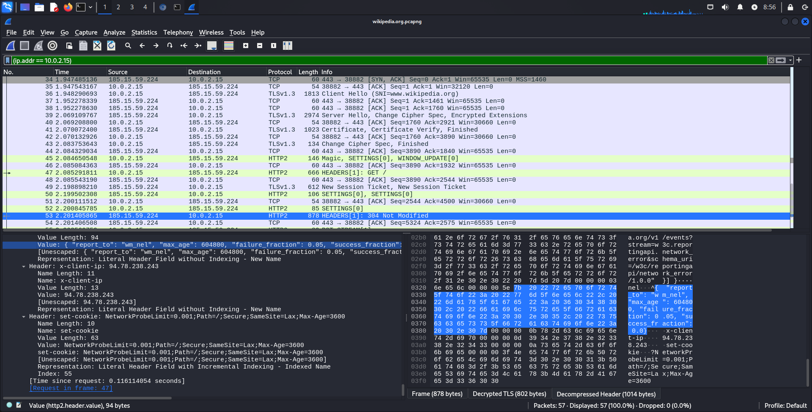
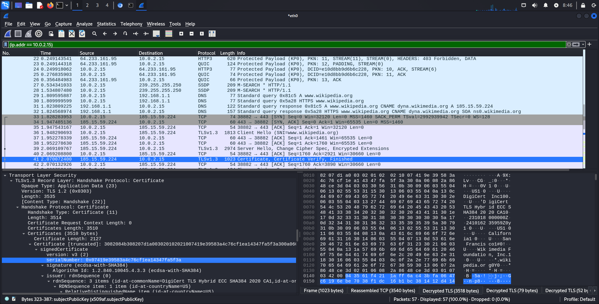

Урок 1. Основы сетевой безопасности

Настроить расшифровку трафика, как это было сделано в лекции.
Открыть в chromium (чтобы работала расшифровка) сайт https://wikipedia.org

Найти запрос Server Hello, в нем найти Certificate и Serial Number
Через меню Файл в Wireshark сохранить файл с захвачеными данными.

В качестве решения приложить:
архив с захваченными данными

[Файл wikipedia.org.pcapng](wikipedia.org.pcapng)

скриншот, где видно работу расшифровки трафика

скриншот с Certificate и Serial Number.

